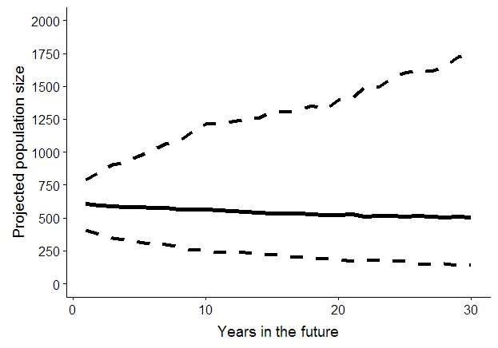

```{r setup, include=FALSE, warning = FALSE, message = FALSE}
knitr::opts_chunk$set(echo = FALSE, fig.align = "center", fig.height = 3, fig.width = 4)
library(tidyverse)
library(readxl)
library(cowplot)
library(googlesheets)
library(kableExtra)
```
   
### Pre- and post-class assessment  
  
We asked four multiple choice questions before and after the course to assess both baseline understanding and our effectiveness at communicating some key ideas.  
  
#### Questions  
  
_The correct answers are in bold_  
   
__1.	What is a model?__  
a.	Someone who walks in fashion shows and is photographed a lot.  
b.	A mathematical equation.  
__c.	A simplified representation of reality.__  
d.	A computer program used to predict future events.  
  
__2.	What information does a regression coefficient tell you?__  
__a.	It quantifies the relationship between a predictor variable and a response variable.__  
b.	It describes the correlation between two predictor variables in the model.  
c.	It tells you the probability that a covariate is an important predictor of the response variable.  
d.	It tells you how close the observed value is to the mean.  
  
__3.	What types of uncertainty can we resolve using statistical models?__  
a.	Demographic stochasticity and observational uncertainty  
__b.	Observational uncertainty and ecological uncertainty__  
c.	Partial controllability and environmental stochasticity  
d.	Environmental stochasticity and demographic stochasticity  

__4.	Which of the following statements is a correct interpretation of the population projection below?__  
_The solid line is the median and the dashed lines are the 95% confidence intervals_   
a.	This population has high resiliency.  
b.	This population will most likely be extinct in 30 years.  
__c.	This population will most likely remain stable for the next 30 years.__  
d.	It is more likely than not that there will be at least 1000 individuals in the population in 30 years.  
   
<div style = "width:300px; height: 200px">

</div>
   

#### Reponses  
   
```{r}
res <- read_excel("assessment-results.xlsx", 
                  sheet = "responses")
```

```{r}
res %>% 
  select(person, `correct-pre`, `correct-post`) %>% 
  gather(type, score, 2:3) %>% 
  mutate(type = fct_relevel(c("correct-pre" = "Pre-class",
                              "correct-post" = "Post-class")[type],
                            "Pre-class")) %>% 
  group_by(person, type) %>%
  summarize(score = mean(score)) %>% 
  ggplot(aes(x = score, fill = type)) + 
  geom_histogram(binwidth = 0.25, col = "gray") +
  facet_wrap(~type, scales= "free") +
  scale_fill_manual(values = c("dodgerblue3", "palegreen4"),
                    name = "") +
  theme(strip.background = element_rect(fill = "white"),
        strip.text = element_text(margin = margin(1,1,1,1), size = 14),
        legend.position = "none") +
  xlab("Overall score") +
  ylab("Count") +
  ylim(0,6)
```
  
```{r}
res %>% 
  select(person, `correct-pre`, `correct-post`) %>% 
  gather(type, score, 2:3) %>% 
  mutate(type = fct_relevel(c("correct-pre" = "Pre-class",
                              "correct-post" = "Post-class")[type],
                            "Pre-class")) %>% 
  group_by(person, type) %>%
  summarize(score = mean(score)) %>% 
  ungroup() %>% 
  group_by(type) %>% 
  summarize(`Average score` = round(mean(score), 3))
```
  
Overall the assessment scores improved after the class, with the average increasing from 0.516 before the course to 0.641 after. The overall distribution of scores shifted higher.  
   
```{r}
res %>% 
  select(question, `correct-pre`, `correct-post`) %>% 
  gather(type, score, 2:3) %>% 
  mutate(type = fct_relevel(c("correct-pre" = "Pre-class",
                              "correct-post" = "Post-class")[type],
                            "Pre-class")) %>% 
  group_by(question, type) %>%
  summarize(score = mean(score)) %>% 
  ggplot(aes(x = question, y = score, fill = type)) + 
  geom_bar(width = 0.8, col = "gray", 
           stat = "identity", position = "dodge") +
  scale_fill_manual(values = c("dodgerblue3", "palegreen4"),
                    name = "") +
  theme(legend.position = "top") +
  xlab("Question number") +
  ylab("Proportion correct") +
  ylim(0, 1)
```
  
The proportion of correct answer improved for all questions except for question 1, which most students answered correctly before the class as well.  
  
  
#### Course evaluations  
  
We asked students to complete an anonymous course evaluation via Google Forms. 
  
```{r}
eval_responses = gs_title("SSA 200 Course Evaluation (Responses)")
ws = gs_ws_ls(eval_responses)[1]
eval = gs_read(ss = eval_responses, ws = ws)
```
   
Most of the questions had the students choose a response that ranged from 1 (low) to 5 (high).  
  
```{r}
eval %>% 
  select(-Timestamp) %>% 
  gather(question, response, c(1,3:7)) %>% 
  select(question) %>% 
  distinct() %>% 
  kable() %>% 
  kable_styling(bootstrap_options = c("striped", "hover"))
```

   
```{r, fig.width = 12, fig.height = 9}
eval %>% 
  select(-Timestamp) %>% 
  gather(question, response, c(1,3:7)) %>% 
  select(question, response) %>% 
  group_by(question) %>% 
  count(response) %>% 
  ungroup() %>% 
  mutate(question = as.factor(question)) %>%
  complete(response, nesting(question), fill = list(n = 0)) %>% 
  ggplot(aes(x = response, y = n, fill = response)) +
  scale_fill_gradient(low = "dodgerblue2", high = "palegreen4") +
  geom_bar(stat = "identity") +
  facet_wrap(~question, scales = "free", 
             labeller = label_wrap_gen(width = 40)) +
  theme(strip.background = element_rect(fill = "white"),
        legend.position = "none",
        strip.text = element_text(size = 12)) +
  xlab("Response") +
  ylab("Count")
```

One question asked students to evaluate the level of detail provided, with 1 = too little, 5 = too much, and 3 = just right.  
  
```{r, fig.height = 3, fig.width = 4}

cc <- scales::seq_gradient_pal("dodgerblue2", "palegreen4", "Lab")(seq(0,1,length.out=5))

eval %>% 
  select(-Timestamp) %>% 
  gather(question, response, 2) %>% 
  select(question, response) %>% 
  group_by(question) %>% 
  count(response) %>% 
  ungroup() %>% 
  full_join(expand.grid(question = "How did you feel about the level of detail covered? (3 = just right)",
                       response = c(1:5))) %>% 
  mutate(question = as.factor(question),
         response = as.factor(response)) %>% 
  complete(response, nesting(question), fill = list(n = 0)) %>% 
  ggplot(aes(x = response, y = n, fill = response)) +
  scale_fill_manual(values = c(cc[1], cc[3], cc[5], cc[3], cc[1])) +
  geom_bar(stat = "identity") +
  facet_wrap(~question, scales = "free", 
             labeller = label_wrap_gen(width = 40)) +
  theme(strip.background = element_rect(fill = "white"),
        legend.position = "none",
        strip.text = element_text(size = 12)) +
  xlab("Response") +
  ylab("Count")
```
  
The final three questions were open-ended.  
  
```{r}
eval %>% 
  select(9) %>% 
  kable() %>% 
  kable_styling(bootstrap_options = c("striped", "hover"))
```

```{r}
eval %>% 
  select(10) %>% 
  kable() %>% 
  kable_styling(bootstrap_options = c("striped", "hover"))
```


```{r}
eval %>% 
  select(11) %>% 
  kable() %>% 
  kable_styling(bootstrap_options = c("striped", "hover"))
```


